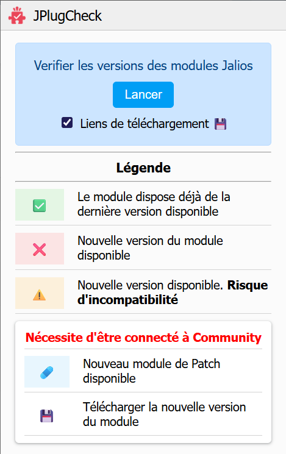

# JPlugCheck

<h1 align="center">
  <sub>
    
  </sub>
  Jalios Plugins Version Checker
</h1>

<span align="center">

  ![Version][BADGE_VERSION]
  [![Chrome Web Store][BADGE_CHROME]][CHROME_LINK]
  ![Edge Add-on][BADGE_EDGE]
  ![Firefox Add-on][BADGE_FIREFOX]

</span>

Une **extension de navigateur** conçue pour les administrateurs et développeurs Jalios.  
Elle met en évidence les **plugins nécessitant une mise à jour**, directement dans la page de gestion des modules de votre JPlatform.

## Fonctionnalités

- **Lancement intuitif :** un simple clic suffit à lancer l’analyse.
- **Détection intelligente :** récupère le numéro de la dernière version d’un plugin depuis [Jalios Community](https://community.jalios.com).
- **Comparaison automatique :** compare la version en ligne avec la version installée.
- **Indicateurs visuels clairs :** affiche dans le tableau un symbole :
  - ✅ À jour en version x.y.z
  - ⚠️ Nouvelle version : x.y.z
  - 🩹 Nouveau Patch : x.y-zzz
- **Fonctionnement ciblé :** le lancement n'est possible que depuis la page de gestion des modules.

> [!NOTE]  
> L'indicateur concernant le module de Patch apparaît **uniquement** si vous êtes connecté à Jalios Community.

## Installation

### Option 1 : via les stores de navigateur (disponibilité partielle)

- [Chrome][CHROME_LINK]
> L’extension sera bientôt disponible sur les stores **Edge** et **Firefox**.

### Option 2 : depuis ce dépôt (installation locale)

**Via Git :**

```bash
git clone https://github.com/RudyLaban/JPlugCheck.git
```

**Ou via ZIP :**

1. Cliquer sur le bouton `Code` puis sur `Download ZIP`
2. Extraire le dossier sur votre ordinateur.

**Installation dans le navigateur :**

1. Ouvrir `chrome://extensions` sous Chrome, ou `edge://extensions/` sous Edge.
2. Activer le **mode développeur** en haut de la page.
3. Cliquer sur **"Charger l'extension non empaquetée / décompressée"**.
4. Sélectionner le dossier contenant `manifest.json`.

## Utilisation

1. Accéder à la page `/admin/pluginManager.jsp` de votre JPlatform.
2. Cliquer sur l’icône  JPlugCheck dans la barre du navigateur.
3. Dans la popup, cliquer sur **"Lancer"**.
4. L’analyse est lancée. Un indicateur est ajouté à chaque ligne du tableau.



## Technologies utilisées

- **JavaScript (vanilla)**
- **Chrome Extension API (Manifest V3)**

## Roadmap / Améliorations prévues

### Fonctionnelles

- [ ] 🌐 Déploiement sur les stores de navigateurs :
  - [x] Chrome
  - [ ] Edge
  - [ ] Firefox
- [x] 🩹 Inclusion du PatchPlugin au rapport
- [ ] ℹ️ Indication sur la compatibilité d'un nouveau module avec la version de JPlatform
- [x] 💯 Pourcentage de modules à jour
- [ ] ⬇️ Téléchargement des plugins directement depuis l’extension
- [ ] 🎨 Amélioration de l’interface utilisateur

### Techniques

- [x] 📃 Ajout d'un changelog.md
- [ ] 🔄 Ajout d'un workflow git générant un zip au push d'un tag de version

## À propos

> [!IMPORTANT]
> Cette extension n’est **ni affiliée ni soutenue par Jalios**.  
> Elle accède essentiellement à des pages et informations publiquement accessibles sur Jalios Community. Pour la page du module de patch, qui nécessite une connexion, l’extension peut y accéder **uniquement si l’utilisateur est déjà connecté** à Community, via les informations de session présentes dans le navigateur.  
> Les données extraites ne sont ni stockées ni revendues.  
> L’objectif est d’améliorer la lisibilité des modules dans l’interface d’administration Jplatform.

⚖️ Ce projet est publié sous licence **MIT**. Voir le fichier [LICENSE](LICENSE.txt).

<!-- CONSTANTES -->
[BADGE_VERSION]: https://img.shields.io/badge/version-1.1-blue.svg
[BADGE_CHROME]: https://img.shields.io/badge/Chrome%20Web%20Store-ready-blue.svg?logo=google-chrome
[BADGE_EDGE]: https://img.shields.io/badge/Edge%20Add--on-soon-orange.svg?logo=data:image/png;base64,iVBORw0KGgoAAAANSUhEUgAAABgAAAAYCAYAAADgdz34AAAAAXNSR0IArs4c6QAAAexJREFUSEutVcFxwjAQXGVIH/CGzNgVYFUSqMS4EqASORXYM4E3pA4Iik/SOUKWbZjEn2SQdLt7t3cnMPAlqppegZW9IpYAMg2cBXC2f/XXBNjVMj33hRGxg9/AIh8iQGcMKKD3nzLdhfc7AAtVZQ1bNRY4fq6Lg0w3/tkdwN+C27Ck6CiTGYO0AP8RnINqYHeUydpUjn+cq/okgKmfV/f/lH9/Lm02XQbgTVWrG0T+Al3ECsVF1xDvj4JxqgwApecg09JzD1myzekL9AcBP+Mu97owAPTwApE3/nae7ybD+X5Psheq2gDjFm76pnQKarJlNpxjXXBTWSViO/bGkJqrevsA8zWl0CfwqOsIoHVPT/PIMDin9QpxGlJtFCxUrfsvdTvzXsXQW2PyggB68z+Bnl1db4QqyNra1iH6EftXaNkLwN1IBJynTWfyN6TcOc7UTfQzsemhQP4DBog5ybcy3xPuYqdYzaxfU3MxU5Y8NPtjuRroA+t73ykxhrGgRJqJ+J2sgjlTHmQiYyZgIOrUCdBuM2cI2ic5GYRA2mka1oKH1ZhbxnonXDjBjNGSGF4gQnW9rcO1a4sc3vQZs4o+I/hvY06j89Glz/3gJm5HyVjhowC+17+B7AaxpBXo9oHZcA0wbb8yNqd8ZT8m7T7gMXe23gAAAABJRU5ErkJggg==
[BADGE_FIREFOX]: https://img.shields.io/badge/Firefox%20Add--on-soon-orange.svg?logo=firefoxbrowser

[CHROME_LINK]: https://chromewebstore.google.com/detail/jplugcheck/cbkakodcfmlmghnbmgmdjegbmhbcmmeo