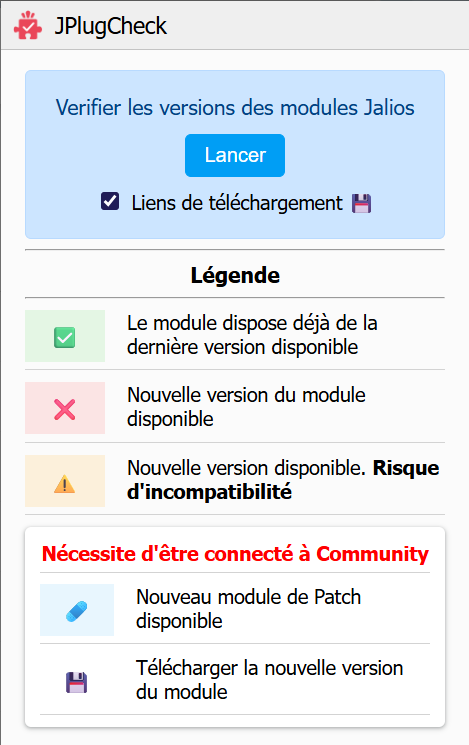
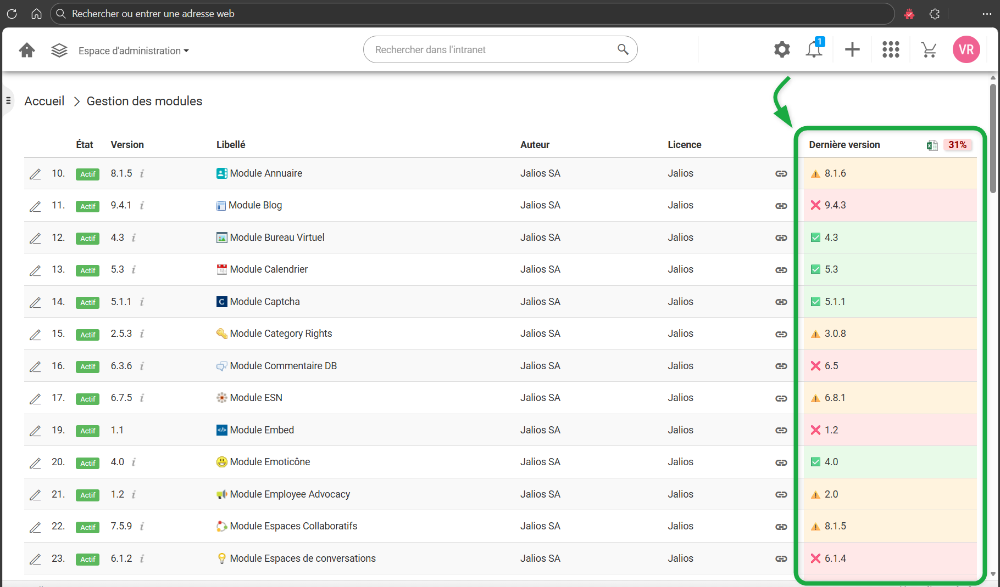

# JPlugCheck

<h1 align="center">
  <sub>
    
  </sub>
  Jalios Plugins Version Checker
</h1>

<span align="center">

  ![Version][BADGE_VERSION]
  [![Chrome Web Store][BADGE_CHROME]][CHROME_LINK]
  ![Edge Add-on][BADGE_EDGE]
  ![Firefox Add-on][BADGE_FIREFOX]

</span>

Une **extension de navigateur** conçue pour les administrateurs et développeurs Jalios.  
Elle met en évidence les **plugins nécessitant une mise à jour**, directement dans la page de gestion des modules de votre JPlatform.

<p align="center">
  
  </sub>
</p>

## Fonctionnalités

- **Lancement intuitif :** un simple clic suffit à lancer l’analyse.
- **Détection et comparaison automatiques :** identifie la dernière version d’un plugin et la compare à celle installée.
- **Indicateurs visuels clairs :** affiche dans le tableau un symbole :
  - ✅ Module jour
  - ❌ Nouvelle version disponible
  - ⚠️ Nouvelle version disponible, mais incompatibilité potentielle
  - 🩹 Nouveau patch disponible
- **Taux de mise à jour :** affiche le pourcentage de modules Jalios à jour.
- **Indicateur de compatibilité :** alerte sur le risque d'incompatibilité entre la dernière version d'un module et la version courante de JPlatform.
- **Lien de téléchargement direct :** option permettant d'ajouter le lien de téléchargement du dernier module.
- **Légende claire :**  détails des icônes affichées directement dans la popup de l'extension.
- **Fonctionnement ciblé :** le lancement n'est possible que depuis la page de gestion des modules.
- **[NEW] Export CSV :** ajout d'une icône permettant de télécharger le rapport au format CSV

> [!NOTE]  
> Les fonctionnalités suivantes nécessitent d'être **préalablement connecté** à Jalios Community :
>
> - Rapport pour le module de Patch
> - Ajout du lien de téléchargement
>

## Installation

### Option 1 : via les stores de navigateur (disponibilité partielle)

- [Chrome][CHROME_LINK]
> L’extension sera bientôt disponible sur les stores **Edge** et **Firefox**.

### Option 2 : depuis ce dépôt (installation locale)

**Via Git :**

```bash
git clone https://github.com/RudyLaban/JPlugCheck.git
```

**Ou via ZIP :**

1. Récpérer le zip de la [dernière release](https://github.com/RudyLaban/JPlugCheck/releases/download/1.2/jplugcheck-1.2.zip)
2. Extraire le dossier sur votre ordinateur.

**Installation dans le navigateur :**

1. Ouvrir `chrome://extensions` sous Chrome, ou `edge://extensions/` sous Edge.
2. Activer le **mode développeur** en haut de la page.
3. Cliquer sur **"Charger l'extension non empaquetée / décompressée"**.
4. Sélectionner le dossier contenant `manifest.json`.

## Utilisation

1. Accéder à la page `/admin/pluginManager.jsp` de votre JPlatform.
2. Cliquer sur l’icône  JPlugCheck dans la barre du navigateur.
3. Dans la popup, cliquer sur **"Lancer"**.
4. L’analyse est lancée. Un indicateur est ajouté à chaque ligne du tableau.



## Technologies utilisées

- **JavaScript (vanilla)**
- **Chrome Extension API (Manifest V3)**

## Roadmap / Améliorations prévues

### Fonctionnelles

- [ ] 🌐 Déploiement sur les stores de navigateurs :
  - [x] Chrome
  - [ ] Edge
  - [ ] Firefox
- [x] 🩹 Inclusion du PatchPlugin au rapport
- [x] ℹ️ Indication sur la compatibilité d'un nouveau module avec la version de JPlatform
- [x] 💯 Pourcentage de modules à jour
- [x] ⬇️ Téléchargement des plugins directement depuis l’extension
- [x] 📊 Export du rapport en CSV
- [ ] 🎨 Amélioration de l’interface utilisateur

### Techniques

- [x] 📃 Ajout d'un changelog.md
- [ ] 🔄 Ajout d'un workflow git générant un zip au push d'un tag de version

## À propos

> [!IMPORTANT]
> Cette extension n’est **ni affiliée ni soutenue par Jalios**.  
> Elle accède essentiellement à des pages et informations publiquement accessibles sur Jalios Community. Pour la page du module de patch, qui nécessite une connexion, l’extension peut y accéder **uniquement si l’utilisateur est déjà connecté** à Community, via les informations de session présentes dans le navigateur.  
> Les données extraites ne sont ni stockées ni revendues.  
> L’objectif est d’améliorer la lisibilité des modules dans l’interface d’administration Jplatform.

⚖️ Ce projet est publié sous licence **MIT**. Voir le fichier [LICENSE](LICENSE.txt).

<!-- CONSTANTES -->
[BADGE_VERSION]: https://img.shields.io/badge/version-1.2-blue.svg
[BADGE_CHROME]: https://img.shields.io/badge/Chrome%20Web%20Store-ready-blue.svg?logo=google-chrome
[BADGE_EDGE]: https://img.shields.io/badge/Edge%20Add--on-soon-orange.svg?logo=
[BADGE_FIREFOX]: https://img.shields.io/badge/Firefox%20Add--on-soon-orange.svg?logo=firefoxbrowser

[CHROME_LINK]: https://chromewebstore.google.com/detail/jplugcheck/cbkakodcfmlmghnbmgmdjegbmhbcmmeo
